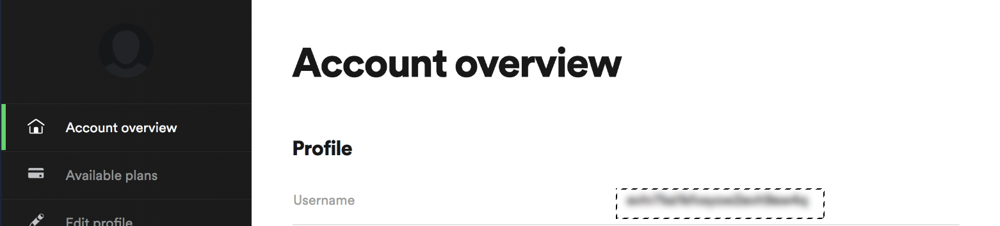
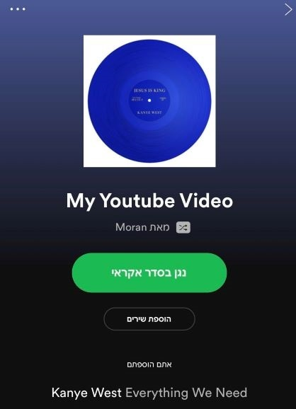

## Python_project-YoutubetoSpotify-
Enter a Youtube music video URL  link and find the song on your spotify in a new playlist!

**prior requirements**:
1. Install All Dependencies - 
```
json
requests
youtube_dl
spotipy.util
spotipy
```

#you can read the Authorization Guide of spotify [here](https://developer.spotify.com/documentation/general/guides/authorization-guide/)

2. Please follow my steps to get permission to access the Spotify API:
(in general, we need to create an app that will access the Spotify API once it gets permission from the user)

- [x]  log in and register a Spotify app [here](https://developer.spotify.com/dashboard/login)
- [x] Go to your new developer dashboard and just click on "Create an App" (don't worry about the details).
- [x] Save your Client Secret and Client ID (you'll find them in the app panel).
- [x] Collect your Username by Log into Spotify and then go here: [Account Overview](https://www.spotify.com/us/account/overview/) and its your Username.
- [x] run the authurization part in the code with the variables you just collected.
- [x] Once your run the code,it will open an authorization panle in your web browser. Follow the link,log in  and you should see something like this:

Please click on agree to authorize your app
- [x] the next step will take your to redirect URI whitch may be a nonexistent page.
- [x] Get your token [here](https://developer.spotify.com/console/post-playlist-tracks/?playlist_id=&position=&uris=):
Click 'get token' and then select your scopes : "playlist-modify-private" and "playlist-read-private" and  request the token

- [x] **it's a wrap! you have everything you need to run the code.**


## final result on my app: 
# Hebrew version



